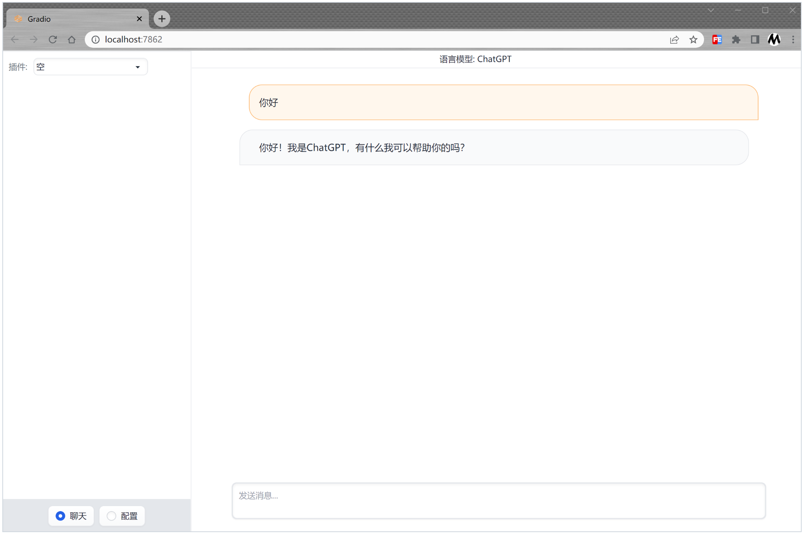

# AiChat

<div align="center">
	
</div>

## 模型
百模大战排位：（1）[UC伯克利LLM排位赛](https://huggingface.co/spaces/lmsys/chatbot-arena-leaderboard) （2）[C-Eval排行榜](https://cevalbenchmark.com/static/leaderboard_zh.html)
| 模型 | 版本 | 支持进度 |
| :-- | :-- | :--: | 
| ChatGPT | GPT-4 <br> GPT-3.5-turbo <br> ChatGPT-免费版 | ♻️ <br> ♻️ <br> ✅  | 
| ChatGLM | THUDM/chatglm2-6b <br> THUDM/chatglm2-6b-int4 <br> THUDM/chatglm-6b <br> THUDM/chatglm-6b-int8 <br> THUDM/chatglm-6b-int4 <br> THUDM/chatglm-6b-int4-qe | ✅ <br> ✅ <br> ✅ <br> ✅ <br> ✅ <br> ✅| 
| 百川 | baichuan-inc/Baichuan-7B <br> baichuan-inc/Baichuan-13B-Base <br> baichuan-inc/Baichuan-13B-Chat | ♻️<br>♻️<br>♻️ |

## 插件
| 插件 | 功能 | 支持进度 |  
| :-- | :-- | :--: |  
| 文档摘要 | 自动生成文档的摘要 | ✅ |  
| 对话SQL数据库 | 用自然语言与SQL数据库对话 | ♻️ |  
| 对话本地私有文档 | 用自然语言与本地私有文档对话 | ♻️ |

## Run
```bash
# ubuntu 20.04
sudo apt install -y swig

conda create -n chatchat python=3.10
conda activate chatchat
pip install -r requirements.txt
python main.py
```

# TODO
- https://github.com/SCIR-HI/Huatuo-Llama-Med-Chinese